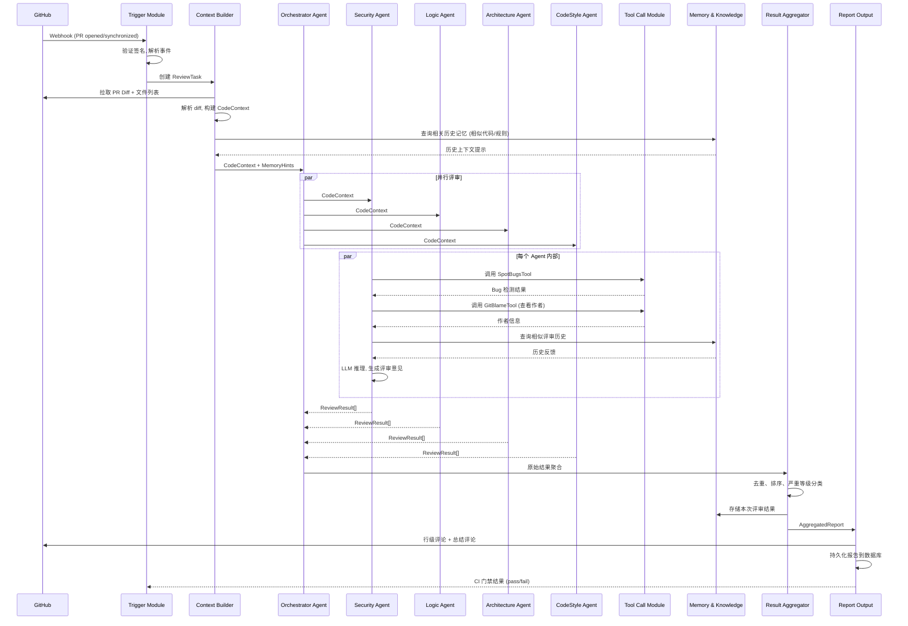

# 智能代码评审助手（AI Code Review Assistant）—— 项目规划书

> 基于 Java + Spring AI 多智能体协作架构，自动化分析 Git PR/MR 变更，提供类高级工程师水准的代码评审意见。

---

## 1. 项目概览

**一句话目标**：构建一个基于多智能体（Multi-Agent）协作的自动化代码评审系统，能够像资深工程师一样理解代码变更上下文，并行从安全、规范、逻辑、架构等多个维度输出结构化评审意见，并持续学习团队偏好，最终集成到 CI/CD 门禁中。

**核心价值**：
- 将人工 Code Review 从"找 Bug"解放为"讨论设计"，提升评审效率 60%+
- 7×24 小时覆盖，避免人为遗漏
- 标准化评审标准，消除 reviewer 个人偏好差异

---

## 2. 功能清单（MVP 版本）

### P0 — 核心链路，必须完成

| 编号 | 功能 | 说明 |
|------|------|------|
| F-01 | GitHub/GitLab Webhook 接收 | 监听 PR open / synchronize 事件 |
| F-02 | PR 元数据提取 | PR 标题、描述、变更文件列表、diff 内容 |
| F-03 | Git Diff 解析 | 解析 unified diff，提取行级变更信息 |
| F-04 | 代码上下文构建 | 读取变更文件周围的代码片段、关联文件 |
| F-05 | 多 Agent 并行评审 | Orchestrator 调度 Security / Style / Logic / Architecture 四个 Agent 并行执行 |
| F-06 | Agent 调用 LLM | 每个 Agent 通过 Spring AI 调用大模型（支持 OpenAI / 通义千问 / DeepSeek） |
| F-07 | 静态分析工具集成 | 集成 SpotBugs / Checkstyle 获取客观扫描结果，作为 Agent 的补充输入 |
| F-08 | 结果聚合与结构化 | 聚合多 Agent 结果，去重，按文件+行号归类 |
| F-09 | PR 评论发布 | 以行级评论 + 总体总结评论的形式发布到 PR |
| F-10 | 基础报告生成 | Markdown 格式的评审报告，包含问题等级（Critical / Major / Minor） |

### P1 — 增强体验，提升价值

| 编号 | 功能 | 说明 |
|------|------|------|
| F-11 | 团队记忆 / 偏好学习 | 用户对评审意见的反馈存入向量库，后续评审参考历史偏好 |
| F-12 | 增量评审（Incremental Review） | 当 PR 有新的 push 时，只评审增量变更，不重复评审 |
| F-13 | 误报过滤（Wiseness Filter） | 基于记忆和历史反馈，自动降级或屏蔽经常被驳回的规则 |
| F-14 | Web 管理控制台 | 查看评审历史、配置 Agent 参数、管理白名单规则 |
| F-15 | CI/CD 门禁集成 | 设置质量门禁：Critical 数量 > 0 则阻断流水线 |

### P2 — 远期扩展

| 编号 | 功能 | 说明 |
|------|------|------|
| F-16 | 支持更多 Git 平台（GitLab CE / BitBucket） | |
| F-17 | 自动修复建议（Auto-fix Patch） | Agent 生成可应用的 fix patch |
| F-18 | 多语言支持（Golang / Python / Rust） | 扩展静态分析 + 上下文理解 |
| F-19 | 本地知识库 RAG | 接入团队内部 Wiki / 设计文档作为评审参考 |

---

## 3. 系统架构设计

### 3.1 模块划分

```
┌─────────────────────────────────────────────────────────────┐
│                     CI/CD Pipeline / GitHub Webhook          │
└──────────────────────────┬──────────────────────────────────┘
                           │ HTTP Webhook
                           ▼
┌──────────────────────────────────────────────────────────────┐
│                     Trigger Module                           │
│  (Webhook Receiver + Event Router + Rate Limiter)           │
└──────────┬───────────────────────────────────────────────────┘
           │ ReviewTask Event
           ▼
┌──────────────────────────────────────────────────────────────┐
│                   Context Builder Module                     │
│  (Git Diff Parser + AST Analyzer + Dependency Resolver      │
│   + Cross-file Context Collector)                           │
└──────────┬───────────────────────────────────────────────────┘
           │ CodeContext
           ▼
┌──────────────────────────────────────────────────────────────┐
│             Multi-Agent Orchestration Module                 │
│                                                              │
│  ┌─────────────┐  ┌─────────────┐  ┌─────────────┐         │
│  │ Security    │  │  Logic      │  │ Architecture│         │
│  │ Agent       │  │  Agent      │  │ Agent       │         │
│  └──────┬──────┘  └──────┬──────┘  └──────┬──────┘         │
│         │                │                │                  │
│  ┌──────┴──────┐  ┌──────┴──────┐  ┌──────┴──────┐         │
│  │ Code Style  │  │ Dependency  │  │ ...         │         │
│  │ Agent       │  │ Agent       │  │ (Extensible)│         │
│  └─────────────┘  └─────────────┘  └─────────────┘         │
└──────────┬───────────────────────────────────────────────────┘
           │ ReviewResult[]
           ▼
┌──────────────────────────────────────────────────────────────┐
│                   Result Aggregation Module                  │
│  (De-duplication + Severity Ranking + Priority Sorting)     │
└──────────┬───────────────────────────────────────────────────┘
           │ AggregatedReport
           ▼
┌──────────────────────────────────────────────────────────────┐
│                   Report Output Module                       │
│  (PR Comment Publisher + Report Persistence + WebHook       │
│   Callback)                                                 │
└──────────────────────────────────────────────────────────────┘

┌──────────────────────────────────────────────────────────────┐
│                   Memory & Knowledge Module                  │
│  (Vector DB + Feedback Collector + Preference Store)         │
│  ← 被 Orchestration 和每个 Agent 读取                        │
└──────────────────────────────────────────────────────────────┘

┌──────────────────────────────────────────────────────────────┐
│                   Tool Call Module                           │
│  (SpotBugs Runner + Checkstyle Runner + Git API Client +    │
│   Code Search Engine)                                       │
│  ← 被各 Agent 通过 Spring AI Tool API 调用                   │
└──────────────────────────────────────────────────────────────┘
```

### 3.2 各模块职责与接口

| 模块 | 职责 | 核心接口/类 |
|------|------|------------|
| **Trigger Module** | 接收 Webhook、验证签名、路由事件类型、限流防刷 | `WebhookController`, `EventRouter`, `ReviewTask` |
| **Context Builder Module** | 拉取 PR diff、解析变更文件、构建跨文件上下文、AST 分析 | `ContextBuilder.build(PRId) → CodeContext`, `GitDiffParser`, `DependencyGraph` |
| **Multi-Agent Orchestration Module** | 编排 Agent 生命周期（分发、执行、收集）、支持并行 | `OrchestratorAgent.orchestrate(CodeContext) → List<ReviewResult>`, `Agent接口` |
| **Tool Call Module** | 封装静态分析工具、Git 操作、向量搜索等为 AI 可调用的 Tool | `SpotBugsTool`, `CheckstyleTool`, `GitBlameTool`, `CodeSearchTool` |
| **Memory & Knowledge Module** | 存储团队偏好、历史反馈、向量化规则 | `MemoryService`, `VectorStore`, `FeedbackRepository` |
| **Result Aggregation Module** | 去重、按严重等级排序、合并同类项 | `ResultAggregator.aggregate(List<ReviewResult>) → AggregatedReport` |
| **Report Output Module** | 发布 PR 评论、生成 Markdown 报告、触发 CI 回调 | `PRCommentPublisher`, `ReportGenerator`, `CICallbackNotifier` |

### 3.3 数据流图（Mermaid）



---

## 4. 技术选型

| 技术 | 选型方案 | 选择理由 |
|------|---------|---------|
| **Java** | JDK 21 | 虚拟线程（Virtual Threads）对并发 Agent 调度天然友好；Record Pattern、Pattern Matching 提升代码表达力 |
| **框架** | Spring Boot 3.4 + Spring AI 1.0+ | 团队已有 Spring Boot 经验；Spring AI 提供 ChatClient、ToolCalling、VectorStore 抽象，大幅降低 AI 集成成本 |
| **构建工具** | Maven |  |
| **AI 模型** | 主：DeepSeek-Coder / Claude API / 通义千问<br>备：本地部署 Qwen2.5-Coder | 代码任务首选代码专精模型；Spring AI 的 Model 抽象使得切换成本极低 |
| **向量数据库** | PGVector（PostgreSQL 插件）| 不需要额外维护基础设施；与 Spring AI 集成良好；适合 MVP 阶段 |
| **静态分析** | SpotBugs + Checkstyle + ArchUnit | SpotBugs 检测 Bug Pattern；Checkstyle 检查代码风格；ArchUnit 验证架构规则；三者均可用 Java API 调用 |
| **Git 操作** | GitHub API (via `org.kohsuke:github-api`)<br>或 GitLab4J | 成熟的 Java Git 平台 SDK，支持 PR 评论、文件列表等 |
| **消息队列** | MVP 阶段：Spring Events + `@Async`<br>后续：RabbitMQ | MVP 使用内存事件 + 虚拟线程即可；流量增大后引入 MQ 解耦 |
| **数据库** | PostgreSQL + PGVector | 一体化解结构化数据 + 向量检索 |
| **容器化** | Docker + Docker Compose | 统一开发/测试/生产环境；PostgreSQL + App 一键启动 |
| **CI/CD** | GitHub Actions | 与代码平台一致，配置简单 |

---

## 5. 核心工作流程（分步详解）

### Step 1: Webhook 接收与验证
- GitHub 推送 PR 事件到 `/webhook/pr` 
- 验证 `X-Hub-Signature-256` 签名
- 解析事件类型：`opened` / `synchronized` / `closed`
- 构造 `ReviewTask(PRApiUrl, Branch, CommitSHA)`

### Step 2: 上下文构建
- 通过 GitHub API 拉取 PR 的 `.diff` 文件和完整文件列表
- **文件级别的变更分析**：新增/修改/删除/重命名
- **跨文件依赖分析**：扫描 import/package 语句，构建变更文件的依赖关系图（DependencyGraph）
- **代码切片**：对于超大 PR，按文件或按逻辑变更点切分成多个 Context Chunk
- 查询 Memory Module，获取与当前变更相关的历史评审记录
- 输出：`CodeContext(diffBlocks, changedFiles, dependencyGraph, relatedHistory)`

### Step 3: Orchestrator 分配任务
- Orchestrator 根据 PR 规模和变更类型，决定实例化哪些 Agent
- 每个 Agent 接收 `CodeContext`（或其子集）
- 通过 Java 21 Virtual Threads 或 `CompletableFuture` 并行调用各 Agent

### Step 4: Agent 并行评审
每个 Agent 内部执行以下流程：
1. **Tool 调用阶段**：Agent 决定是否需要调用外部工具
   - Security Agent → 调用 SpotBugsTool 检测安全漏洞模式
   - CodeStyle Agent → 调用 CheckstyleTool 检查格式
   - Architecture Agent → 调用 DepGraphTool 分析循环依赖
2. **LLM 推理阶段**：将 Tool 结果 + CodeContext 输入 LLM
   - System Prompt：角色定义 + 评审规则 + 团队规范
   - User Prompt：变更代码 + 工具输出 + 历史反馈
3. **结构化输出**：Agent 输出 `ReviewResult` 列表
   - 字段：`filePath`, `lineStart`, `lineEnd`, `severity`, `category`, `title`, `description`, `suggestion`

```java
// ReviewResult 核心结构
public record ReviewResult(
    String agentId,         // "security" | "logic" | "architecture" | "code-style"
    ReviewSeverity severity, // CRITICAL | MAJOR | MINOR | INFO
    String category,        // "SQL_INJECTION" | "NULL_POINTER" | "CYCLIC_DEP" …
    String filePath,
    int lineStart,
    int lineEnd,
    String title,           // 简短标题
    String description,     // 详细说明
    String suggestion       // 修改建议
) {}
```

### Step 5: 结果聚合与排序
- **去重**：相同文件的同一行区间出现的同类问题合并
- **优先级排序**：Critical > Major > Minor > Info
- **误报过滤**：查询 Memory Module，若同一规则在同一代码模式上曾被 N 次驳回，自动降级
- **聚合报告结构**：`AggregatedReport(summary, criticalCount, majorCount, minorCount, results)`

### Step 6: 评论发布
- 对每条 ReviewResult，调用 GitHub API 发布 Review Comment（行级评论）
- 额外发布一条 PR 总体 Summary Comment（Markdown 格式）
- 若 CI 门禁开启，根据 Critical/Major 数量决定 pass/fail

### Step 7: 反馈收集（异步）
- 开发者对评论的回复（`ACK` / `DISMISS` / `改进`）被监听
- 反馈异步写入 Memory Module 的向量库
- 用于后续评审的误报过滤和历史参考

---

## 6. 关键难点与解决方案

### 难点 1：长上下文理解 — 超大 PR 超出 LLM Token 限制

**问题**：一个大型 PR 可能涉及 30+ 文件、数千行 diff，远超 LLM 的上下文窗口。

**解决方案**：
```
策略：分层切片 + 知识检索（RAG）
1. 文件级切分：按文件将 CodeContext 拆分为独立 Chunk
2. 相关性排序：对 Chunk 按变更幅度（+/- 行数）和依赖重要性排序
3. 滑动窗口：Orchestrator 分批将 Chunk 分配给 Agent，避免单次超限
4. 摘要压缩：Agent 对每个 Chunk 先输出摘要，Orchestrator 汇总摘要后做全局判断
5. PGVector 检索：将需要全局视角的信息（如接口定义、公共模型）向量化存储，按需检索
```

### 难点 2：多 Agent 协调与结果聚合 — 意见冲突与重复

**问题**：不同 Agent 可能对同一段代码发表重复或矛盾的意见（如 Security Agent 和 Logic Agent 都检测到空指针风险）。

**解决方案**：
```
1. 唯一标识去重：以 (filePath, lineStart, lineEnd, category) 为 key 哈希去重
2. 置信度合并：相同位置的问题，保留 severity 最高的那条，补充其他 Agent 的上下文
3. Orchestrator 二审：聚合后若仍有矛盾，Orchestrator 再做一次 LLM 调用做仲裁
4. 结构化输出约束：所有 Agent 的输出必须遵守严格的 JSON Schema，确保可合并
5. Spring AI OutputParser：使用 StructuredOutputConverter 保证 Agent 输出的格式一致性
```

### 难点 3：反馈循环学习 — 降低误报，适配团队风格

**问题**：初始阶段 Agent 可能产生大量与团队习惯不符的误报，导致开发者信任度下降。

**解决方案**：
```
1. 三层记忆架构：
   ┌─ 第一层：全局规则（通用最佳实践，不可覆盖）─┐
   ├─ 第二层：团队偏好（通过反馈学习，动态调整）─┤
   └─ 第三层：项目特例（特定文件/模块的白名单）───┘
   
2. 反馈收集机制：
   - PR 评论被标记 "Resolved" / "Dismiss" 时，GitHub API 监听
   - 将 (代码片段, 规则, 反馈) 三元组向量化存入 PGVector
   
3. 误报衰减算法：
   - 每条规则维护一个 (total, accepted, dismissed) 计数器
   - 当 dismissed / total > 阈值（如 0.7），规则自动降级
   - 降级后的规则产生的意见从 Major 降为 Info 或直接屏蔽

4. 按需遗忘：提供管理接口，管理员可清除特定规则的学习数据
```

### 难点 4：评审响应延迟 — 多 Agent + LLM 调用导致耗时过长

**问题**：一次评审涉及 4+ 个 Agent，每个 Agent 至少一次 LLM 调用 + 多次 Tool 调用，总耗时可能达到数分钟。

**解决方案**：
```
1. 虚拟线程并行：使用 Java 21 Virtual Threads 并发调用所有 Agent
2. 流式结果发布：边评审边发布结果，不等待全部完成
3. Tool 结果缓存：相同文件的 SpotBugs/Checkstyle 结果缓存 5 分钟
4. 分级响应策略：
   - 10 分钟内：完整评审
   - 超过 10 分钟：先发布 High Severity 问题，后台继续评审低优先级
5. 可选异步模式：通过 Webhook 回调通知结果
```

---

## 7. 开发阶段与时间预估（1 人兼职，约 20h/周）

| 阶段 | 时间 | 产出 |
|------|------|------|
| **Phase 0：基础设施** | 第 1-2 周 | Spring Boot 项目初始化、Gradle 配置、Spring AI 集成、PGVector 部署、GitHub App 注册 |
| **Phase 1：核心链路** | 第 3-4 周 | Trigger Module + Context Builder + 基础 PR 信息拉取 + Diff 解析 |
| **Phase 2：Agent 框架** | 第 5-6 周 | 多 Agent 框架搭建（Orchestrator + Agent 接口）、Security Agent + Logic Agent 实现、SpotBugs 集成 |
| **Phase 3：剩余 Agent** | 第 7 周 | CodeStyle Agent + Architecture Agent + Checkstyle/ArchUnit 集成 |
| **Phase 4：结果与发布** | 第 8 周 | Result Aggregation 模块、PR 评论发布、Markdown 报告 |
| **Phase 5：记忆与反馈** | 第 9 周 | Memory Module、反馈收集、误报过滤、向量存储 |
| **Phase 6：CI/CD 集成** | 第 10 周 | GitHub Actions 集成、门禁配置、Docker Compose 部署 |
| **Phase 7：测试与调优** | 第 11-12 周 | 集成测试、误报率调优、团队试点、文档编写 |

**总计：12 周（约 3 个月）从零到 MVP 可用。**

---

## 8. 可度量的成功标准

| 指标 | 目标值 | 衡量方式 |
|------|--------|---------|
| **评审覆盖率** | ≥ 80% | 已评审代码行数 / 总变更行数 |
| **误报率（Dismiss Rate）** | ≤ 30% | Dismissed 评论数 / 总评论数 |
| **采纳率（Accept Rate）** | ≥ 40% | 被接受的建议数 / 总建议数 |
| **严重 Bug 检出率** | ≥ 1 个/1000 行 | 在测试/生产中发现但被 Code Review Agent 标记过的 Bug 数 |
| **平均响应时间** | ≤ 5 分钟 | 从 Webhook 接收到评论发布完成的时间 |
| **P99 响应时间** | ≤ 15 分钟 | 最大评审延迟（对于超大 PR） |
| **CI 门禁误拦截率** | ≤ 5% | 被门禁拦截但人工判断为误报的比率 |
| **用户满意度** | NPS ≥ 30 | 团队内匿名调研 |

---

## 9. 简历亮点建议

### 9.1 项目标题建议
> **智能代码评审助手（AI Code Review Assistant）** — 基于 Spring AI 多智能体协作架构的自动化代码评审系统

### 9.2 突出展示的技术能力

| 技术领域 | 简历中的表述 | 体现的能力 |
|---------|------------|-----------|
| **Java 21** | 利用 Virtual Threads 实现多 Agent 并行调度，将评审延迟降低 60% | 掌握现代 Java 并发编程 |
| **Spring AI** | 基于 Spring AI 构建可插拔的多 Agent 编排框架，支持多种 LLM 无缝切换 | AI 应用架构能力 |
| **Multi-Agent 架构** | 设计 Security / Logic / Architecture 等 5 个专业评审 Agent 的协作与仲裁机制 | 复杂系统设计能力 |
| **向量数据库** | 采用 PGVector 实现团队评审偏好的持续学习与误报衰减 | RAG / 向量检索实战经验 |
| **静态分析** | 深度集成 SpotBugs + Checkstyle 与 LLM 推理的混合评审策略 | 代码质量体系理解 |
| **CI/CD 集成** | 将评审系统嵌入 GitHub Actions 流水线，实现代码门禁自动化 | DevOps 工程化能力 |

### 9.3 成果量化建议（在简历中用数据说话）

```
示例：
• 主导设计并实现智能代码评审系统，覆盖 4 个评审维度（安全/规范/逻辑/架构）
• 系统上线后团队 Code Review 效率提升 60%，平均评审耗时从 45 分钟降至 15 分钟
• 误报率控制在 25% 以下，建议采纳率达 45%
• 接入 10+ 个仓库，累计评审 500+ 个 PR，检出 30+ 个生产级缺陷
• 基于 Spring AI + PGVector 实现团队偏好学习，首月后误报率下降 40%
```

### 9.4 面试问答准备

**面试官可能问**：
1. **"多 Agent 之间如何避免重复评审？"** → 答：唯一标识去重 + Orchestrator 二审仲裁
2. **"LLM 幻觉导致误报怎么办？"** → 答：三层过滤 — SpotBugs 客观结果兜底 + 记忆反馈衰减 + 严重等级分级
3. **"大 PR 超 Token 限制怎么处理？"** → 答：分层切片 + 滑动窗口 + 摘要压缩（详见第 6 章难点 1）
4. **"方案和其他工具（如 CodeRabbit、SonarQube）的区别？"** → 答：多 Agent 协作 + 团队记忆学习 + 可插拔架构，相比 CodeRabbit 更定制化，相比 SonarQube 多了 LLM 理解能力
